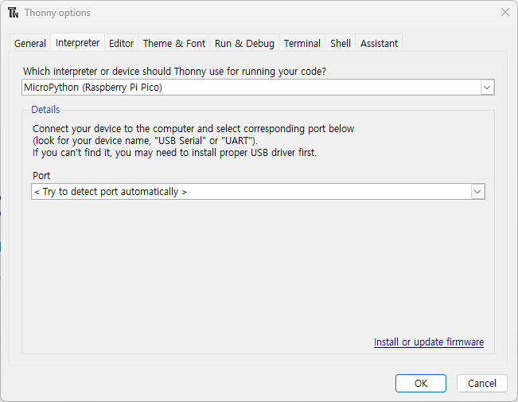

# Pico W 강의 내용 및 순서 / Agenda

2023.11.29
이선우

## 순서

1. 부품 배포 & 확인
2. 라즈베리파이 Pico and Pico W 소개
   - 공식 문서 페이지 [Raspberry Pi Pico](https://www.raspberrypi.com/documentation/microcontrollers/raspberry-pi-pico.html)
   - [RP2040 MCU](https://www.raspberrypi.com/documentation/microcontrollers/rp2040.html#welcome-to-rp2040)

3. 소프트웨어 개발 환경 소개
   - C/C++을 사용하여 소프트웨어를 개발하는 방법: [The C/C++ SDK](https://www.raspberrypi.com/documentation/microcontrollers/c_sdk.html#sdk-setup)
   - 파이썬 언어를 사용하는 방법
   - [Micro Python 소개](https://www.raspberrypi.com/documentation/microcontrollers/micropython.html#what-is-micropython)

4. Micro Python 사용 환경 만들기 실습
   - 라즈베리파이 공식 문서 [안내서](https://www.raspberrypi.com/documentation/microcontrollers/micropython.html)
5. 보드 위 LED 제어하기 실습
6. 외부 LED 및 세그먼트 제어하기 실습
7. 스위치 사용 실습  

---

## 실습 순서

1. 부품 확인 및 하드웨어 꾸미기
   1. 확장보드 준비하기
      1. 브레드보드 장착(접착)하기
      2. 피코WH 보드 커넥터에 삽입하고 micro 5 pin USB 케이블 연결하기
      3. 커넥터 (female to female) 이용하여 피코 보드 GPIO와 LED/스위치 연결하기
         1. GP0 - LED1, GP1 - LED2, GP2 - LED3, GP3 - LED4
         2. GP6 - K3 (switch #3), GP7 - K4 (switch #4)
2. 피코 보드 준비
   1. 마이크로파이썬 실행 파일 다운로드 하기 (uf2 file format) [다운로드 사이트 주소](https://micropython.org/download/rp2-pico-w/rp2-pico-w-latest.uf2)
   2. 피코 보드 USB 메모리 모드로 부팅하기
      1. `BOOTSEL` 스위치를 누른 채로 USB 케이블을 컴퓨터에 연결함
      2. 연결 후 스위치 누르지 않음
   3. 파일 복사하기 (컴퓨터에 새로운 USB메모리를 인식함. 탐색기 등 이용 복사)
3. 컴퓨터 준비하기
   1. [Thonny program 설치하기](https://thonny.org/)
      1. 설치 후 설정하기 : \[Run] 메뉴에서 `Select interpreter...` 선택 후 팝업되는 창에서 `MicroPython (Raspberry Pi Pico)`로 선택함
      2. 아래쪽 `Port` 선택은 `<Try to dectect port automatically >`를 선택함
   
4. 보드 위 LED 제어해보기
    1. `Thonny` 윈도우의 아래쪽 `Shell` 탭을 이용해 보자. (데모 보면서 따라하기)
    2. 보드 내장 LED 일정 시간 간격으로 깜박이는 프로그램 작성하고 실행하기
```python
from machine import Pin
from time import sleep

brdled=Pin('LED',Pin.OUT) #보드 내장 LED 사용하기 위한 정의

while True: #무한루프
    brdled.toggle() #LED 토글하기
    sleep(0.5)    # 0.5초동안 아무것도 안 하기
```

5. 확장보드 LED 제어하기
    1. 확장보드에는 4개의 청색 LED가 장차되어 있음
    2. 이 4개 LED의 음극(cathode)은 GND에 연결되어 있고, 1번 스텝을 통해 양극(anode)은 피코 보드의 GP0~GP3까지 연결되어 있음
    3. 이 4개 LED를 이용하여 4비트 2진수를 표시하는 디스플레이로 활용 가능
    즉, 0(0b0000) ~ 15(0b1111) 16개 수를 표시할 수 있음

 < 0부터 15까지의 2진수를 표시하는 디스플레이 만들기 >
```python
# simulate the 4-bit counter by using the 4 LEDs on the board
#
# @author = senu
# 20231114
from machine import Pin
import time

#set the 4 LEDs
led0=Pin(0, Pin.OUT)
led1=Pin(1, Pin.OUT)
led2=Pin(2, Pin.OUT)
led3=Pin(3, Pin.OUT)

counter=[led3,led2,led1,led0]

#infinite loop
while True:
    for i in range(16): #couting up from 0 to 15
        #binstr = bin(i)
        for j in range(4):
            if (i>>j) % 2 == 1:
                counter[j].on()
            else:
                counter[j].off()
        time.sleep(0.5)
```

6. 푸시버튼 스위치 (push button switch) 사용하기
    1. 관련 내용 강의
       - 푸시 버튼 스위치 관련 자료 [코코아팹 자료](https://kocoafab.cc/learn/2)
       - 풀업/풀다운 회로 관련 자료 [위키독스 MSP430](https://wikidocs.net/28690)
       
    1. 스위치 2개 보드 연결하기 (이미 연결되어 있음)
    1. 프로그램 만들기
       - 스위치 상태 읽어오기
          * [프로그램 1](#프로그램_1)을 실행시키면서 스위치를 눌렸을 때와 그렇지 않을 때의 값을 관측하자.
       - 2개 스위치를 사용하여 `UP-DOWN COUNTER`를 만들어 보자 ([프로그램 2](프로그램_2))
          * 스위치 `K3`를 누르면 값이 증가하고 `K4`를 누르면 감소함
          * 현재 값은 4bit display에 표시함 (즉 0~15의 숫자만 표시 가능)    
       - 실행해보고 문제점을 찾아보자
          * 정상적으로 동작하는가? 
          * 어떤 문제가 발생하는가?
       - 스위치 입력 문제 원인 및 해결 방법
          * 증상: 스위치를 한 번 눌렀는데 이상한 숫자가 나옴 
          * 원인: 0.1초의 딜레이가 있음에도 사람이 스위치를 누르고 있는 동안 여러번 루프가 돌아 cntval 값이 증가/감소하기 때문..
       - [디바운싱(debouncing) 기법 적용하기](./debouncing.md)
       - 지금까지 배운 기법들을 이용하여 정상적으로 동작하는 카운터 만들기

#### 프로그램 1
```python
# 2개 스위치가 GP6과 GP7에 연결되어 있음
# 이 스위치를 입력기능으로 설정한 GP6/7에 내부 풀업(pull-up) 기능 활성화하여 사용
upsw = Pin(6, Pin.IN, Pin.PULL_UP)
dnsw = Pin(7, Pin.IN, Pin.PULL_UP)
while True: #0.5초 간격으로 읽어 표시함
    print(upsw.value())
    time.sleep_ms(500)  
```

#### 프로그램 2
```python
#앞에 필요한 것들은 위 코드를 참고하여 잘 넣을 것

display4bit=[led3,led2,led1,led0]

#4비트 이진 디스플레이를 함수로 만듬
#function for 4bit display
def display(value):
    # masking 4bits
    value &= 0x0F
    for j in range(4):
        if (value>>j) % 2 == 1:
            display4bit[j].on()
        else:
            display4bit[j].off()

cntval = 0

while True:
    upsw_val1 = upsw.value()
    dnsw_val1 = dnsw.value()
    
    #check if it is pushed
    if upsw_val1 == 0:
        cntval += 1
        if cntval > 15:
            cntval = 0
    if dnsw_val1 == 0:
        cntval -= 1
        if cntval < 0:
            cntval = 15
            
    #display the current value
    display(cntval)
    time.sleep(0.1)
```

