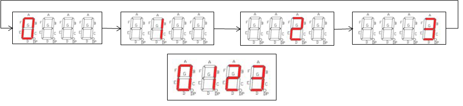

# FND (7세그먼트) 제어하기

FND(Flexible Numeric Display)의 가장 간단한 버전인 7세그먼트 디스플레이 장치를 피코 보드와 연결하여 사용해보자. 

사용하기 위해 먼저 이 장치가 어떻게 만들어져 있고 어떻게 작동하는지 이해하자.

---
## 공부하기

넷상의 좋은 자료를 이용해 공부하자. 
 [부산외국어대학교에서 만든 자료?](http://kocw.xcache.kinxcdn.com/KOCW/document/2019/bufs/choijinho0218/4.pdf)

---

## 실습 순서

### 0. FND 동작 방식 이해하기

모두 4X8=32개의 LED로 이루어진 4 digits 7 segment FND에서 내가 지정한 LED (세그먼트)를 ON시키려면 어떻게 전원을 공급해야 하는지 이해하자.

1. 브레드보드에 FND 장치를 꽂는다.
2. 피코 보드의 **전원 선 (+3.3V, 피코보드 핀 #36)**과 **접지선(GND, 핀#38,#33, #28, #23, #18, #13,#8, #3)**을 브레드보드의 전원부 (+/- 표시된 곳)에 연결한다. 
3. DIG1 핀(핀 12)은 8개의 LED의 음극 부분이 공통으로 연결된 핀이므로 저항을 거쳐 (직렬 연결) GND로 연결되어야 첫 번째 자리수의 8개 LED가 ON 될 수 있다. 따라서 키트에 포함되어 있는 220$\Omega$ 저항 하나를 이용하여 FND pin #12와 GND를 연결한다. 
4. 전선을 이용하여 전원을 A~G까지 차례대로 연결하며 어떤 세그먼트가 켜지는지 관찰한다. DP도 켜본다.
5. 다음으로 다른 저항을 이용하여 DIG2 핀(#8)을 GND에 연결하고 A~DP까지의 8개 세그먼트에 전원을 공급하여 각 세그먼트를 켜보자.
6. DIG3, DIG4의 공통접지 핀(Common Cathode)도 저항으로 GND에 연결한 후 A ~ DP의 한 핀에 전원을 연결하여 어떻게 작동하는지 관찰하고 이를 통해 FND가 어떻게 작동하는지 이해하자.

### 1. 하드웨어 꾸미기

FND와 피코 보드를 1차로 연결하자.
* FND의 8개 핀을 피코 보드에 연결하자.
* 각자가 자유롭게 FND의 핀과 피코 보드의 __GP0~GP28__ 를 연결하면 된다. (*반드시 GP? 핀이어야 함*)
* 다음은 하나의 예일뿐 *반드시* 이를 따를 필요는 없다.
 
| PICO |     FND |
|-----|--------------|
|GP9   |      A/11 |
|GP8   |      B/7 |
|GP7   |      C/4 |
|GP6   |      D/2 |
|GP18  |      E/1 |
|GP19  |      F/10 |
|GP20  |      G/5 |
|GP21  |      DP/3 |

### 2. 피코 보드에서 1개 세그먼트 on/off 하기

 켜고 끄는 프로그램을 작성하자. 다음 코드를 참고하여 8개 세그먼트 (A~DP)와 연결된 피코 핀을 정의하고 각 핀을 on/off 해보자.
 ```python
segA=Pin(15,Pin.OUT)
segB=Pin(14,Pin.OUT)
segC=Pin(13,Pin.OUT)
segD=Pin(12,Pin.OUT)
segE=Pin(11,Pin.OUT)
segF=Pin(10,Pin.OUT)
segG=Pin(9,Pin.OUT)
```
각 핀을 3.3V과 0V로 만들기 위한 명령어는 ```segA.on()``` 혹은 ```segA.off()```를 사용하면 된다.

#### *실습하기*
1. 먼저 저항으로 켜고자 하는 Digit을 GND에 연결한다. 

|     FND |
|--------------|
|      DIG1 (맨 앞자리) / 12 |
|      DIG2 (2번째 자리) / 9 |
|      DIG3 (3번째 자리) / 8 |
|      DIG4 (마지막 자리) / 6 |

2. **Thonny** program을 열고 위의 핀 정의 코드를 입력한 후 각 세그먼트를 on하거나 off해보자.
3. 저항을 추가하여 다른 Digit (다른 자리)도 켜보자.

### 3. 7개 세그먼트를 제어하여 숫자 표시하기
앞서 공부했던 방법처럼 7개 세그먼트를 동시에 제어(on or off)하여 0부터 9까지의 숫자와 10(A)부터 15(F)까지를 digit 하나에 표시하는 프로그램을 작성하자.

다음과 같은 파이썬 dictionary datatype으로 매핑 테이블을 만들어 사용하자.

 ```python
 segLst=[segA, segB, segC, segD, segE, segF, segG]

 segmap = {0:[1,1,1,1,1,1,0], 1:[0,1,1,0,0,0,0], 2:[1,1,0,1,1,0,1],\
          3:[1,1,1,1,0,0,1], 4:[0,1,1,0,0,1,1], 5:[1,0,1,1,0,1,1],\
          6:[1,0,1,1,1,1,1], 7:[1,1,1,0,0,0,0], 8:[1,1,1,1,1,1,1],\
          9:[1,1,1,1,0,1,1], 10:[1,1,1,0,1,1,1], 11:[0,0,1,1,1,1,1],\
          12:[1,0,0,1,1,1,0], 13:[0,1,1,1,1,0,1], 14:[1,0,0,1,1,1,1],\
          15:[1,0,0,0,1,1,1]}
```          
이렇게 만든 테이블은 다음 코드와 같은 방법으로 A~G 7개 세그먼트를 제어하여 원하는 숫자를 표시할 수 있다.

 ```python
mapinfo = segmap[num]
for i in range(7):
    segLst[i].value(mapinfo[i])
```

#### *실습하기*
0부터 F까지 표시하는 프로그램을 작성하자.

### 4. 자릿수 제어하기

앞서 실습에서 이해한 것처럼, 이번엔 4개 자릿수를 제어하는 프로그램을 작성해보자. DIG1 ~ DIG4로 표현되는 4개 모듈은 각각 8개의 LED로 구성되어 있고, 공통의 GND로 묶여 외부 핀 (#12, 9, 8, 6)과 연결되어 있다. 이 4개 핀을 피코 보드가 제어하여 프로그램에서 원하는 모듈을 on/off하는 프로그램을 작성하자.

앞서 4개 digit 핀에 연결되 저항의 다른 쪽을 GND가 아니라 다음 표와 같이 피코 보드의 GP 핀에 연결하자.

| PICO |     FND |
|-----|--------------|
|GP13  |      DIG1 (맨 앞자리) / 12 |
|GP12  |      DIG2 (2번째 자리) / 9 |
|GP11  |      DIG3 (3번째 자리) / 8 |
|GP10  |      DIG4 (마지막 자리) / 6 |

이렇게 연결하면 이제 피코 보드가 각 자리에 숫자를 표시할지 말지를 제어할 수 있다. *피코 핀의 출력이 0 (0 V)이어야 세그먼트가 켜짐*

다음 코드를 참고하여 프로그램을 통해 지정된 자리에 지정된 숫자를 표시하는 프로그램을 작성하자.

 ```python
 dig1 = Pin(13, Pin.OUT, value=1)  #initially turn off
dig2 = Pin(12, Pin.OUT, value=1)
dig3 = Pin(11, Pin.OUT, value=1)
dig4 = Pin(10, Pin.OUT, value=1)

digitLst = [dig1, dig2, dig3, dig4]

#예로 첫번째 디짓을 on하려면
digitLst[0].value(0)  #혹은 dig1.off() 왜 ON인데 꺼지지?
#반대로 끄려면
dig1.on()  # 혹은 digitLst[0].value(1)
```

#### *실습하기*
앞 자리부터 차례대로 0부터 F까지 순서대로 표시하는 프로그램을 작성하자.


### 5. 다이나믹 구동 방법

#### 시각 잔상 효과(Persistence of vision)

- 일련의 정지영상을 고속으로 움직일 때 하나의 움직이는 영상으로 간주하는 눈의 능력. 이는 다른 조각(그림)이 나타날 때까지 망막에 각각의 자국이 남아 있으므로 해서 영상의 겹침이 일어난다. [위키피디아](http://en.wikipedia.org/wiki/Persistence_of_vision)
- 대부분의 현대 영화: 24 frames per second (fps)
- Example: 4개 7segment display 

#### 다이나믹 구동 사용 이유

7segment를 4개 사용하려면..
- 정적 방식 (직접 연결 방식): 8(dot 포함)개의 segment 제어를 위해 8개의 출력 핀 필요 X 4개 = 32개의 출력 필요.
- 동적 구동 방식: 잔상 효과 이용
    - 4개 7세그먼트의 a~dp(8개) 핀을 모두 동일한 8개 출력 핀에 연결, 공통 단자를 별도 출력 핀에 연결하여 전체 ON/OFF 제어  8+4=12개의 출력 필요
    - 깜박이지 않으며 적당한 밝기로 보이도록 적절한 인터벌 설정 필요.


