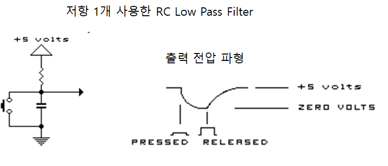

# 푸시 버튼 스위치 채터링 방지 방법 (debouncing)

* 기계적인 스위치가 가지는 원천적인 문제점인 Contact bounce 혹은 채터링(*chattering*) 문제에 대해 알아보자  [Wikipedia](https://en.wikipedia.org/wiki/Switch#Contact_bounce)
* 이 문제를 해결하는 방법은 다음과 같은 것들이 있다

## Hardware적인 방법
- RC Low-pass filter 회로 이용 
  - 장점: 간단한 회로
  - 단점: 느린 응답성
  
         
- 별도 전용 칩을 사용: [ELM410](https://pdf1.alldatasheet.co.kr/datasheet-pdf/view/142617/ELM/ELM410.html)

## Software적인 방법 
  
### 스텝 1
일정 시간 간격(약 수십ms)을 두고 2번 읽어 동일한 값이면 인정하는 방법

```python
    while True:
    #double reading for debouncing
    #check the switch input
    state1= upsw.value() 
    time.sleep_ms(30)
    state2= upsw.value()
    if state1 == state2 and state1 == 0: #push a button
        # 스위치가 눌렸을 때 필요한 조치를 수행함...
        # 조치 1 
        # 조치 2 
  ```

  ### 스텝 2
  위와 같은 방법으로 스위치 입력을 처리하면 아무 문제가 없나?
  이 경우에도 사람이 스위치를 누르고 있는 동안 컴퓨터는 여러번 검사하고 조건에 만족하므로 한 번 누른 것으로 작동하지 않음.
  따라서 다음과 같이 변수를 이용하여 **1번만 유효**하도록 조치해야 함.
```python
onceflag = True

while True:
    #avoid the bounding problem
    sw_val1 = upsw.value()
    time.sleep_ms(20)
    sw_val2 = upsw.value()
        
    #check if it is pushed
    if sw_val1 == sw_val2:
        if onceflag  and sw_val2 == 0:  #처음 눌렀을 때..
            onceflag = False
            #스위치 눌렀을 때 필요한 조치.. 예를 들어
            #cntval += 1
            #기타 등등
        elif sw_val2 == 1: #다시 손을 뗏을 때
            onceflag = True
```  